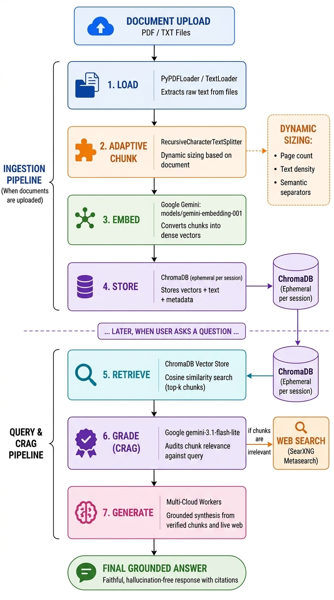

# ⚡ SPARK AI — Multi-Agent RAG Application

A production-grade, multi-agent AI assistant powered by a **Multi-Cloud Architecture** (Nvidia NIM, Google Gemini, and Ollama Cloud). Features intelligent task routing, document RAG, and quality validation — optimized for speed and free-tier deployment.

**🔗 Live Demo:** [https://darkrock04-spark.hf.space/](https://darkrock04-spark.hf.space/)

---

## 📖 Project Overview

SPARK AI is a robust Generative AI web application providing an advanced conversational interface. Unlike simple chatbots that rely on a single LLM, SPARK AI routes each request through a sophisticated, multi-agent pipeline powered by a **Multi-Cloud Architecture**. From intelligent task routing and creative generation to document-grounded RAG (Retrieval-Augmented Generation) and content safety validation, every agent is optimized for its specific role to deliver fast, highly accurate, and reliable responses.

---

## ✨ Features

| Feature | Description |
|---------|-------------|
| 🧠 **Chat & Reason** | Multi-agent pipeline with automated planning, dynamic routing, and two-stage validation |
| 📑 **Corrective RAG (CRAG)** | Upload PDFs/TXT — document relevance grading with automatic SearXNG web search fallback |
| 🔄 **Self-Reflective Anti-Hallucination** | Dynamic date grounding with mid-generation cutoff detection and live web search loopback |
| 🔒 **Content Safety** | Two-stage security gate (keyword pre-filter + LLM fallback) |
| ✅ **Quality Validation** | Consolidated relevance + factuality + coherence check with Langfuse trace scoring |
| ⚡ **Specialized Workers** | Multi-cloud routing for coding (`gemini-3.5-flash`), creative, and general tasks (`gpt-oss:120b`) |
| 🔄 **Session Memory** | Remembers your conversation within the current session via semantic summarization |
| 📊 **Pipeline Streaming** | Real-time visibility into each processing stage with animated badges |
| 🔭 **Langfuse Observability & Prompt Registry** | Full agent tracing, 11 managed/versioned prompts, generation linking, and automated quality scoring |

---


---

## 🚀 Quick Start

```bash
# 1. Clone
git clone https://github.com/Darkrock04/GEN_AI_APPLICATION.git
cd GEN_AI_APPLICATION

# 2. Install
pip install -r requirements.txt

# 3. Configure API Keys
# Create a .env file and set the following keys:
# NVIDIA_API_KEY=your_key_here
# OLLAMA_API_KEY=your_key_here
# GEMINI_API_KEY=your_key_here
# SEARXNG_URL=https://site0230-local.hf.space
# Langfuse Observability & Prompt Management:
# LANGFUSE_PUBLIC_KEY=pk-lf-your_key
# LANGFUSE_SECRET_KEY=sk-lf-your_key
# LANGFUSE_HOST=https://cloud.langfuse.com

# 4. Start backend
uvicorn backend.main:app --reload

# 5. Start frontend (new terminal)
streamlit run frontend/app.py
```

---

## 🤖 Models

| Agent | Provider | Model | Purpose |
|---|---|---|---|
| Security Gate | **Ollama** | `nemotron-3-nano:30b` | Fast SAFE/UNSAFE classification |
| Quick Greeter | **Ollama** | `gpt-oss:120b` | Natural, instantaneous responses for greetings |
| Planner | **Google** | `gemini-3.1-flash-lite` | Date-aware task decomposition & search planning |
| Document Grader | **Google** | `gemini-3.1-flash-lite` | Corrective RAG (CRAG) binary document relevance grading |
| Router | **Ollama** | `gemma4:31b` | Classify: coding/creative/general |
| Worker (General) | **Ollama** | `gpt-oss:120b` | General generation & factual prose |
| Worker (Creative) | **Ollama** | `gpt-oss:120b` | Creative writing & brainstorming |
| Worker (Coding) | **Google** | `gemini-3.5-flash` | Code generation & deep technical synthesis |
| Validator | **Google** | `gemini-3.1-flash-lite` | Factual grounding & cutoff auditing |
| Evaluator | **Ollama** | `nemotron-3-super` | Polish & LaTeX formatting |
| Embeddings | **Google** | `gemini-embedding-001` | Document RAG vectors |

All models accessed via their respective free-tier/trial APIs.

---

## 🔭 Langfuse Observability & Prompt Management

SPARK AI utilizes **Langfuse** as a centralized observability engine and prompt control plane:

- **11 Managed Prompts:** All agent prompts (`security_gate_prompt`, `simple_answer_prompt`, `planner_prompt`, `document_grader_prompt`, `router_prompt`, `worker_general_prompt`, `worker_coding_prompt`, `worker_creative_prompt`, `validator_prompt`, `evaluator_prompt`, `history_summarizer_prompt`) are managed in the Langfuse Prompt Registry.
- **Auto-Seeding on Startup:** When the FastAPI server boots, `ensure_prompts_seeded()` automatically creates any missing prompts in Langfuse tagged `spark-ai` and labeled `production`.
- **Zero-Downtime Hot-Swapping:** Prompts are fetched with a 300-second TTL cache. You can edit prompt templates or instructions directly in the Langfuse UI, and the live application updates within 5 minutes without restarting or redeploying.
- **Generation-to-Prompt Linking:** Every LLM generation is tied to its prompt version in metadata, allowing you to track token consumption, cost, and latency per prompt iteration.
- **Trace Quality Scoring:** The output of `validation_node` automatically logs an evaluation score (`quality_validation` = `1.0` or `0.0`) with validator feedback directly into the Langfuse trace.

---

## 📁 Project Structure

```
SPARK-AI/
├── app.py                      # HF Spaces launcher (FastAPI + Streamlit)
├── requirements.txt            # Python dependencies (includes langfuse)
├── .env                        # Environment variables (gitignored)
├── backend/
│   ├── api_models.py           # Pydantic request/response schemas
│   ├── llm_factory.py          # Model registry & multi-cloud LLM initialization
│   ├── graph_agent.py          # LangGraph multi-agent pipeline (core)
│   ├── langfuse_prompt_manager.py # Prompt registry, auto-seeding, TTL cache & scoring
│   ├── vector_store.py         # ChromaDB RAG engine with adaptive chunking
│   ├── tools.py                # SearXNG live web search integration
│   └── main.py                 # FastAPI server, startup seeding & endpoints
├── frontend/
│   └── app.py                  # Streamlit chat UI
├── deploy/
│   └── HUGGINGFACE_README_SNIPPET.md
├── docs/                       # Detailed documentation
└── chroma_db/                  # Vector database (gitignored)
```

---


## 📡 API Reference

| Method | Path | Purpose |
|--------|------|---------|
| `GET` | `/health` | Backend health check |
| `POST` | `/chat` | Synchronous chat (returns full response) |
| `POST` | `/chat/stream` | Streaming chat (NDJSON, one event per pipeline node) |
| `POST` | `/upload_doc` | Upload PDF/TXT for RAG |
| `GET` | `/documents` | List uploaded documents |
| `DELETE` | `/documents/{filename}` | Delete specific document |
| `POST` | `/clear_session` | Wipe all data & start fresh |

---


## 🔧 Session & Memory Behavior

- **Current session:** AI remembers your entire conversation (last 10 messages sent as context)
- **Page reload / tab close:** Everything is cleared — no persistent storage
- **Clear Session button:** Wipes chat history, uploaded documents, and vector store

---

## 📄 Document RAG Pipeline



| Document Size | Chunk Size | Overlap |
|---|---|---|
| ≤ 3 pages | 400 chars | 100 |
| 4–10 pages | 600 chars | 150 |
| 11–30 pages | 1000 chars | 200 |
| 30+ pages | 1500 chars | 300 |

---

## 📚 Documentation

See [`docs/`](docs/) for detailed documentation:

1. [Project Overview](docs/01_Project_Overview.md)
2. [Architecture & Workflow](docs/02_Architecture_and_Workflow.md)
3. [Models & Agents](docs/03_Models_and_Agents.md)
4. [Technical Modules](docs/04_Technical_Modules.md)
5. [RAG Concepts](docs/05_RAG_Concepts.md)
6. [Features Deep Dive](docs/06_Features_Deep_Dive.md)
7. [API Reference](docs/07_API_Reference.md)


