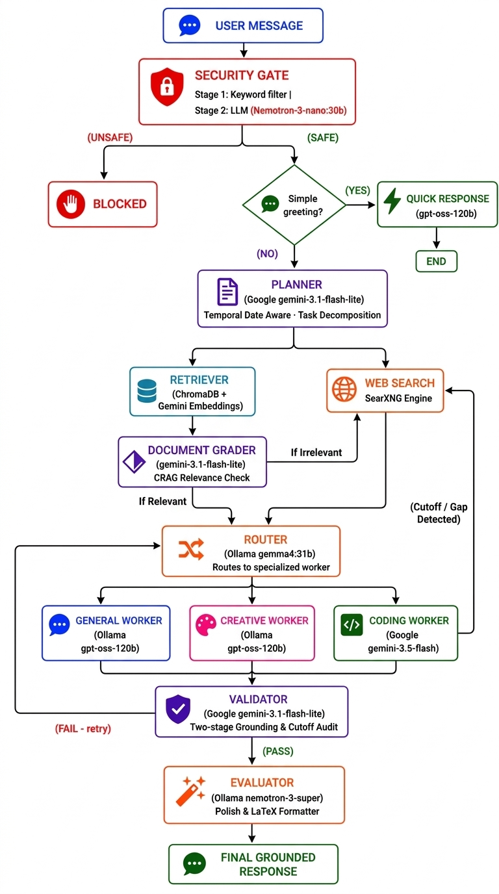
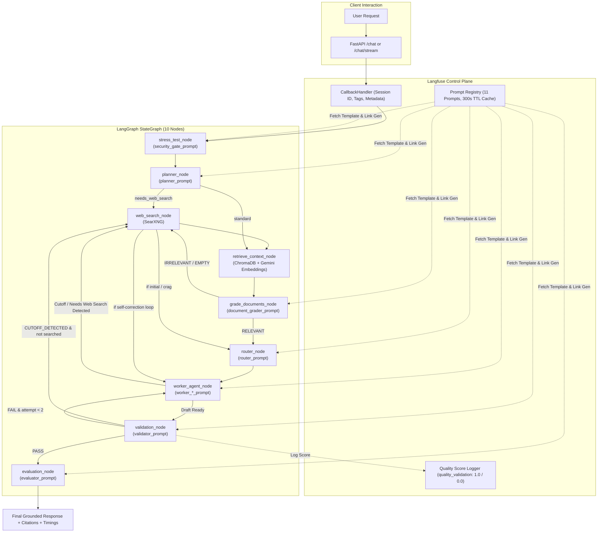

# 02 — Architecture & Multi-Agent Workflow

## How the Pipeline Works

Every user message flows through a **LangGraph StateGraph** — a directed graph where each node is a specialized agent. Routing is dynamic based on the content of the request.



## LLM Calls Per Request Type

| Request Type | Total LLM Calls | Path |
|---|---|---|
| Simple greeting ("hello") | **1** | Security (keyword only) → Quick Response |
| Complex query (local RAG, relevant docs) | **6** | Security + Planner + Document Grader + Router + Worker + Validator |
| Complex query (CRAG: irrelevant docs → web search) | **6** | Security + Planner + Document Grader + Web Search + Router + Worker + Validator |
| Complex query (live web search requested) | **6** | Security + Planner + Web Search + Router + Worker + Validator |
| Complex query (Self-RAG: cutoff detected → web search) | **7** | Security + Planner + Router + Worker + Web Search + Worker retry + Validator |
| Complex + evaluator | **+1** | Above + Evaluator (long responses only) |
| Complex + 1 validation retry | **+1** | Above + Worker retry + Validator |

---

## Enterprise Corrective RAG (CRAG) & Self-RAG Architecture

SPARK AI implements an **adaptive, self-correcting agentic graph** that actively eliminates hallucinations, outdated cutoff disclaimers, and irrelevant document retrievals:
1. **Dynamic Temporal Grounding:** Planner, Worker, and Validator are dynamically injected with the execution date (`{{current_date}}`).
2. **Document Relevance Grader (`grade_documents`):** Every chunk retrieved from ChromaDB is evaluated by a fast evaluator (`gemini-3.1-flash-lite`) using `document_grader_prompt`. If the retrieved documents lack relevance to the user's specific question, the system dynamically pivots to live internet search via SearXNG.
3. **Adaptive Self-Correction Loop:** If a worker LLM encounters a knowledge cutoff or missing data mid-generation and outputs `[NEEDS_WEB_SEARCH: <query>]` or cutoff apologies, `route_after_worker` intercepts the draft, triggers SearXNG web search, and re-invokes the worker with fresh web evidence.
4. **Two-Stage Validation:** The validator assesses factual grounding and catches hallucinated or cutoff responses, rerouting to web search if ungrounded.

---

## Observability & Prompt Management in the Workflow

Every execution of the LangGraph pipeline is observed and managed through Langfuse:



### 1. Root Trace Instrumentation
- In `process_chat()` and `stream_graph_updates()`, the pipeline initializes the Langfuse `CallbackHandler`.
- Trace attributes are propagated automatically:
  - `langfuse_session_id`: Matches the unique per-request session ID.
  - `langfuse_trace_name`: Set to `"SPARK-AI-Workflow"`.
  - `langfuse_tags`: Tagged with `["production", "agentic-rag"]`.

### 2. Node-Level Generation Linking
- Within `_safe_llm_call()`, when an agent node executes, it requests its prompt template from `get_managed_prompt(prompt_name)`.
- The prompt object is attached to the LangChain invoke metadata:
  ```python
  config={"metadata": {"langfuse_prompt": prompt_obj}}
  ```
- This directly links every LLM generation to its active prompt version in the Langfuse dashboard.

### 3. Automated Quality Scoring
- The `validation_node` evaluates drafts against relevance, factuality, and coherence criteria.
- Once evaluated, `log_validation_score()` logs a numeric metric (`1.0` for approved, `0.0` for failed) along with validator critique comments into the Langfuse trace.

