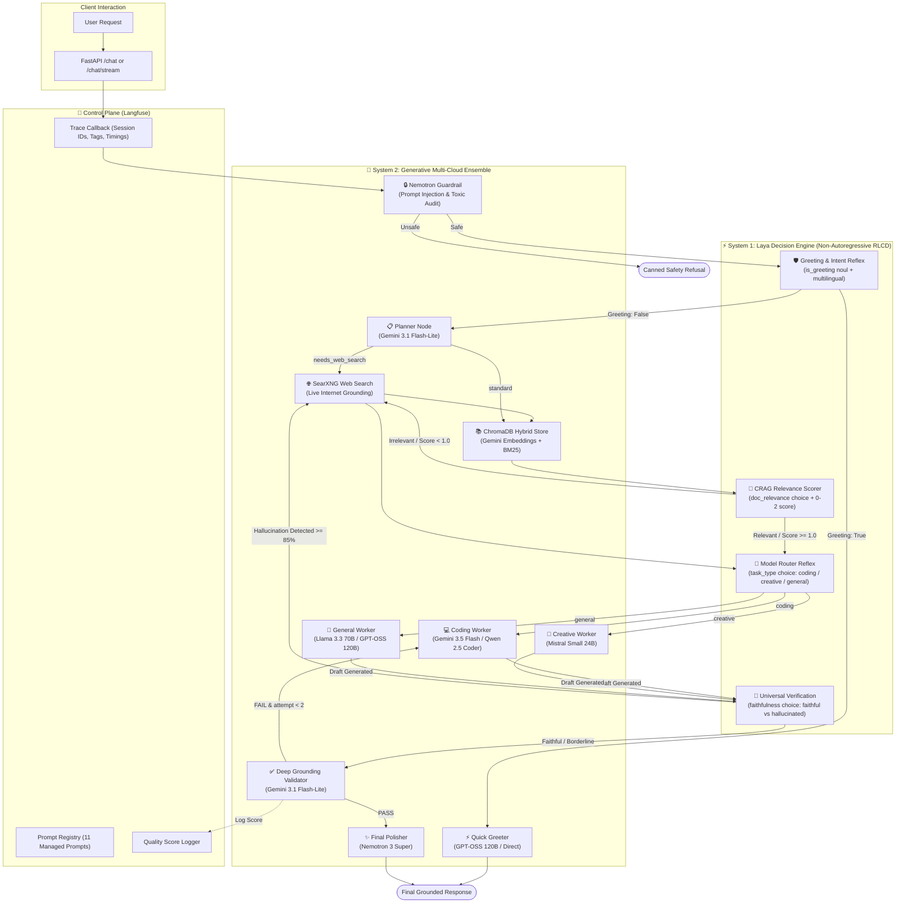

# 02 — Architecture & Multi-Agent Workflow

## The Dual-Brain Cognitive Architecture (System 1 + System 2)

SPARK AI implements a **Dual-Process Cognitive Architecture** inspired by Daniel Kahneman's model of human cognition:

* **System 1 (Reflex Arc — Laya Engine):** An ultra-fast, non-autoregressive decision engine running ModernBERT-large (English) and mmBERT-base (100+ languages) fine-tuned via **Reinforcement Learning for Calibrated Decisions (RLCD)**. It operates in sub-second forward passes without streaming tokens, returning mathematically calibrated probabilities for safety triage, greeting detection, CRAG document relevance scoring, model routing, and Universal Verification.
* **System 2 (Prefrontal Cortex — Generative Ensemble):** Slower, deliberate, multi-agent frontier models (Google Gemini 3.1 Flash-Lite, Gemini 3.5 Flash, Qwen 2.5 Coder 32B, Mistral Small 24B, Llama 3.3 70B, and Nvidia Nemotron) dedicated to task decomposition, query planning, code synthesis, creative writing, and factual critique.


---

## Decision & Generation Load Distribution

| Pipeline Phase | Primary Engine | Fallback Engine | Primitive Type | Typical Latency |
|---|---|---|---|---|
| **Safety Guardrail** | **Nvidia Nemotron** (`nemotron-3-nano:30b`) | Rule-based heuristics | Binary Audit | ~300ms |
| **Greeting & Triage** | **System 1 (Laya)** | `SIMPLE_PATTERNS` regex | `is_greeting: noul` | ~150ms |
| **Execution Planning** | **System 2 (Gemini)** (`gemini-3.1-flash-lite`) | Direct pass-through | Structured Text Plan | ~350ms |
| **CRAG Document Grading** | **System 1 (Laya)** | **Gemini 3.1 Flash-Lite** | `doc_relevance: choice` & `score` | ~180ms |
| **Worker Routing** | **System 1 (Laya)** | **Gemma-4 31B** (Ollama Cloud) | `task_type: choice` (`coding`, `creative`, `general`) | ~140ms |
| **Code Generation** | **System 2 (Gemini / Qwen)** | Mistral / Llama | Autoregressive Token Stream | 2.0s – 5.0s |
| **Universal Verification** | **System 1 (Laya)** | **Gemini 3.1 Flash-Lite** | `faithfulness: choice` (Claim check) | ~200ms |
| **Final Polishing** | **System 2 (Nemotron 3 Super)** | Draft pass-through | Text Refinement | ~400ms |

---

## Dual-Process Workflow Diagram


```mermaid
flowchart TD
    subgraph ClientPlane["Client Interaction"]
        User["User Request"] --> Entry["FastAPI /chat or /chat/stream"]
    end

    subgraph SystemOnePlane["⚡ System 1: Laya Decision Engine (Non-Autoregressive RLCD)"]
        LayaTriage["🛡️ Greeting & Intent Reflex\n(is_greeting noul + multilingual)"]
        LayaCRAG["📑 CRAG Relevance Scorer\n(doc_relevance choice + 0-2 score)"]
        LayaRouter["🚦 Model Router Reflex\n(task_type choice: coding / creative / general)"]
        LayaVerify["🔬 Universal Verification\n(faithfulness choice: faithful vs hallucinated)"]
    end

    subgraph SystemTwoPlane["🧠 System 2: Generative Multi-Cloud Ensemble"]
        SafetyGate["🔒 Nemotron Guardrail\n(Prompt Injection & Toxic Audit)"]
        FastReply["⚡ Quick Greeter\n(GPT-OSS 120B / Direct)"]
        Planner["📋 Planner Node\n(Gemini 3.1 Flash-Lite)"]
        WebSearch["🌐 SearXNG Web Search\n(Live Internet Grounding)"]
        ChromaStore["📚 ChromaDB Hybrid Store\n(Gemini Embeddings + BM25)"]
        CodingWorker["💻 Coding Worker\n(Gemini 3.5 Flash / Qwen 2.5 Coder)"]
        CreativeWorker["🎨 Creative Worker\n(Mistral Small 24B)"]
        GeneralWorker["📖 General Worker\n(Llama 3.3 70B / GPT-OSS 120B)"]
        DeepValidator["✅ Deep Grounding Validator\n(Gemini 3.1 Flash-Lite)"]
        Evaluator["✨ Final Polisher\n(Nemotron 3 Super)"]
    end

    subgraph ObservabilityPlane["🔭 Control Plane (Langfuse)"]
        Registry["Prompt Registry (11 Managed Prompts)"]
        TraceHandler["Trace Callback (Session IDs, Tags, Timings)"]
        ScoreLogger["Quality Score Logger"]
    end

    Entry --> TraceHandler --> SafetyGate
    SafetyGate -->|Safe| LayaTriage
    SafetyGate -->|Unsafe| Blocked([Canned Safety Refusal])

    LayaTriage -->|Greeting: True| FastReply --> Output([Final Grounded Response])
    LayaTriage -->|Greeting: False| Planner

    Planner -->|needs_web_search| WebSearch --> ChromaStore
    Planner -->|standard| ChromaStore
    ChromaStore --> LayaCRAG

    LayaCRAG -->|Relevant / Score >= 1.0| LayaRouter
    LayaCRAG -->|Irrelevant / Score < 1.0| WebSearch --> LayaRouter

    LayaRouter -->|coding| CodingWorker
    LayaRouter -->|creative| CreativeWorker
    LayaRouter -->|general| GeneralWorker

    CodingWorker & CreativeWorker & GeneralWorker -->|Draft Generated| LayaVerify
    LayaVerify -->|Hallucination Detected >= 85%| WebSearch
    LayaVerify -->|Faithful / Borderline| DeepValidator

    DeepValidator -.->|Log Score| ScoreLogger
    DeepValidator -->|FAIL & attempt < 2| CodingWorker
    DeepValidator -->|PASS| Evaluator --> Output
```

### 1. Root Trace Instrumentation
- In `process_chat()` and `stream_graph_updates()`, the pipeline initializes the Langfuse `CallbackHandler`.
- Trace attributes are propagated automatically:
  - `langfuse_session_id`: Matches the unique per-request session ID.
  - `langfuse_trace_name`: Set to `"SPARK-AI-Workflow"`.
  - `langfuse_tags`: Tagged with `["production", "agentic-rag"]`.

### 2. Node-Level Generation Linking
- Within `_safe_llm_call()`, when an agent node executes, it requests its prompt template from `get_managed_prompt(prompt_name)`.
- The prompt object is attached to the LangChain invoke metadata:
  ```python
  config={"metadata": {"langfuse_prompt": prompt_obj}}
  ```
- This directly links every LLM generation to its active prompt version in the Langfuse dashboard.

### 3. Automated Quality Scoring
- The `validation_node` evaluates drafts against relevance, factuality, and coherence criteria.
- Once evaluated, `log_validation_score()` logs a numeric metric (`1.0` for approved, `0.0` for failed) along with validator critique comments into the Langfuse trace.

