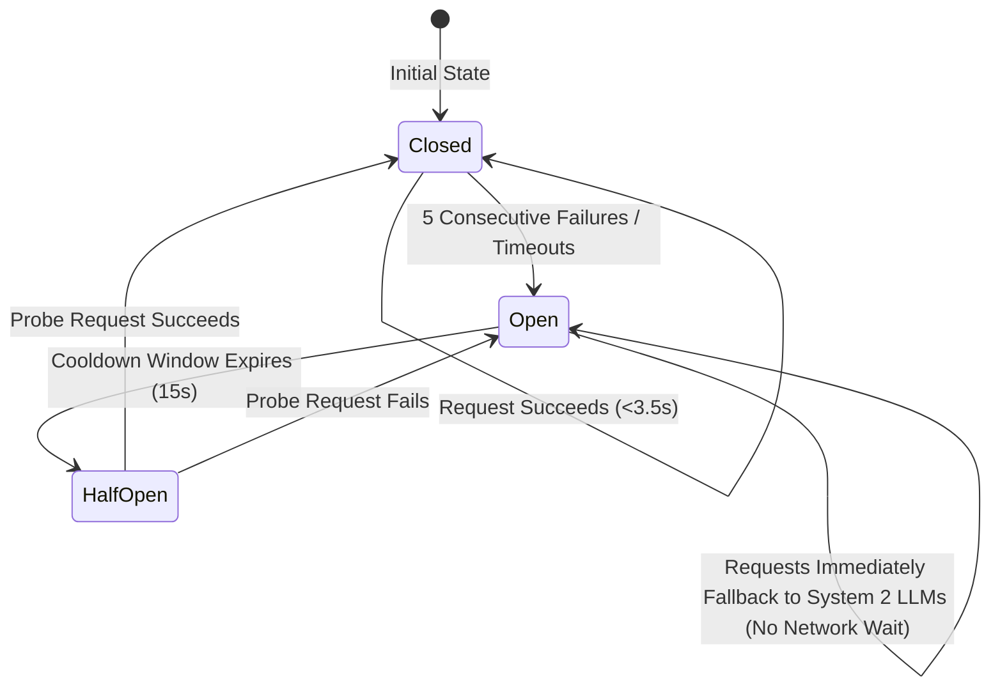

# 03 — Models & Agent Roles (Dual-Brain Multi-Cloud Architecture)

## The Dual-Brain Cognitive Engine Paradigm (System 1 + System 2)

Conventional Multi-Agent systems rely exclusively on autoregressive Large Language Models (LLMs) ranging from 30B to 120B parameters for every decision, classification, and safety check. Waking up a heavy generative model to answer a simple binary question (e.g., *"Is this a greeting?"* or *"Is this document chunk relevant?"*) incurs massive latency penalties (1.5s–3.5s per step), consumes significant token quotas, and introduces stochastic variability.

SPARK AI pioneers an enterprise **Dual-Process Cognitive Architecture** inspired by Daniel Kahneman's cognitive theory:
* **System 1 (Reflex Arc — Laya Decision Engine):** Ultra-fast, non-autoregressive decision heads powered by **ModernBERT-large** (English) and **mmBERT-base** (100+ languages) fine-tuned with **Reinforcement Learning for Calibrated Decisions (RLCD)**. It executes single-pass forward classifications in sub-second timeframes (~100–250ms), producing mathematically calibrated probability distributions without token-by-token generation.
* **System 2 (Prefrontal Cortex — Generative Frontier Ensemble):** Deep, deliberative multi-cloud LLMs (Google Gemini 3.5 Flash, Gemini 3.1 Flash-Lite, Nvidia Nemotron, Ollama Cloud GPT-OSS 120B, and Gemma-4 31B) dedicated to task decomposition, query planning, production-grade code synthesis, creative writing, and factual critique.

---

## ⚡ System 1: Laya Decision Engine

### 1. Underlying Foundations
- **Base Encoders:** ModernBERT-large (English decision model) and mmBERT-base (multilingual decision model across 100+ languages).
- **Training Paradigm:** Reinforcement Learning for Calibrated Decisions (RLCD). Decision heads are calibrated so output scores reflect true posterior probabilities rather than overconfident softmax approximations.
- **Inference Mechanism:** Single forward pass through the encoder backbone with specialized classification and regression heads (`choice`, `score`, `noul`).
- **Endpoint:** Self-hosted on container environments (`your_self_hosted_laya_url/v1/systemone`) or local container, requiring no proprietary API key.

### 2. Specialized Decision Primitives in SPARK AI
| Primitive Function | Laya Question Type | Candidate Outputs | Latency | Pipeline Node |
|---|---|---|---|---|
| **Greeting & Intent Reflex** | `is_greeting: noul` | `true`, `false` | ~150ms | `stress_test_node` |
| **CRAG Document Grading** | `doc_relevance: choice`<br>`relevance_score: score` | `relevant`, `irrelevant`<br>`0.0 – 2.0` | ~180ms | `grade_documents_node` |
| **Task Routing Reflex** | `task_type: choice` | `coding`, `creative`, `general` | ~140ms | `router_node` |
| **Universal Verification** | `faithfulness: choice` | `faithful`, `hallucinated` | ~200ms | `validation_node` |

---

## 🧠 System 2: Generative Multi-Cloud Ensemble

When deep reasoning, complex code generation, or nuanced prose synthesis is required, the pipeline delegates execution to specialized frontier models distributed across multiple cloud providers to optimize throughput and maximize free-tier resilience.

### 1. Google AI Studio (Gemini)
- **`gemini-3.5-flash`:** Frontier coding model optimized for complex software architecture, syntax rigor, debugging, and multi-file code synthesis.
- **`gemini-3.1-flash-lite`:** Rapid planning, date-aware query decomposition, deep grounding critique, and primary System 2 fallback for CRAG and Universal Verification.
- **`gemini-embedding-001`:** High-throughput 768-dimensional semantic embeddings for dense vector RAG.

### 2. Ollama Cloud
- **`nemotron-3-nano:30b` (Nvidia Nemotron):** Dedicated security gatekeeper for prompt injection audit and toxic input classification.
- **`gpt-oss:120b`:** High-capacity general intelligence worker for in-depth factual explanations, document summarization, and creative writing.
- **`gemma4:31b`:** System 2 fallback router and semantic conversation history summarizer.
- **`nemotron-3-super`:** Final polish evaluator for LaTeX mathematical formatting and markdown rendering.

### 3. Nvidia NIM
- Enterprise microservice infrastructure providing backup inference and low-latency specialized model execution.

---

## Complete Model & Agent Assignment Matrix

| Agent / Role | Cognitive System | Cloud / Host Provider | Model / Engine | Prompt / Decision Primitive | Strategic Purpose |
|---|---|---|---|---|---|
| **Security Gate** | System 2 (Safety Guardrail) | Ollama Cloud | `nemotron-3-nano:30b` | `security_gate_prompt` | High-precision prompt injection and adversarial query audit. |
| **Greeting Reflex** | System 1 (Reflex Arc) | Laya Self-Host | mmBERT-base / ModernBERT | `is_greeting: noul` | Instant sub-second greeting detection across 100+ languages. |
| **Quick Greeter** | System 2 (Conversational) | Ollama Cloud | `gpt-oss:120b` | `simple_answer_prompt` | Natural, warm conversational greeting synthesis. |
| **Planner** | System 2 (Reasoning) | Google (Gemini) | `gemini-3.1-flash-lite` | `planner_prompt` | Date-aware query decomposition & web search trigger. |
| **Document Grader** | System 1 (Reflex Arc) | Laya Self-Host | ModernBERT-large | `doc_relevance: choice` + `score` | Corrective RAG (CRAG) calibrated document relevance grading. |
| **Document Grader Fallback**| System 2 (Reasoning) | Google (Gemini) | `gemini-3.1-flash-lite` | `document_grader_prompt` | Autoregressive fallback when Laya is unreachable. |
| **Router Reflex** | System 1 (Reflex Arc) | Laya Self-Host | ModernBERT-large | `task_type: choice` | Calibrated non-autoregressive intent dispatching. |
| **Router Fallback** | System 2 (Reasoning) | Ollama Cloud | `gemma4:31b` | `router_prompt` | Autoregressive fallback router. |
| **Worker (Coding)** | System 2 (Generative) | Google (Gemini) | `gemini-3.5-flash` | `worker_coding_prompt` | Production-grade code synthesis with strict execution tests. |
| **Worker (Creative)** | System 2 (Generative) | Ollama Cloud | `gpt-oss:120b` | `worker_creative_prompt` | Unconstrained creative writing and brainstorming. |
| **Worker (General)** | System 2 (Generative) | Ollama Cloud | `gpt-oss:120b` | `worker_general_prompt` | Comprehensive multi-source document synthesis. |
| **Universal Verification** | System 1 (Reflex Arc) | Laya Self-Host | ModernBERT-large | `faithfulness: choice` | Instant non-autoregressive factual faithfulness verification. |
| **Validator** | System 2 (Reasoning) | Google (Gemini) | `gemini-3.1-flash-lite` | `validator_prompt` | Multi-dimensional quality, relevance, and cutoff audit. |
| **Evaluator** | System 2 (Generative) | Ollama Cloud | `nemotron-3-super` | `evaluator_prompt` | Final polish, math rendering, and LaTeX formatting. |
| **Memory Summarizer** | System 2 (Reasoning) | Ollama Cloud | `gemma4:31b` | `history_summarizer_prompt` | Semantic compression of multi-turn conversational context. |
| **Embeddings** | System 1 (Vector RAG) | Google (Gemini) | `gemini-embedding-001` | *(Vector Pipeline)* | 768-dimensional dense vector embeddings in ChromaDB. |

---

## Circuit Breaker & High-Availability Fallback

To ensure zero downtime, all System 1 Laya interactions are encapsulated within a **Stateful Circuit Breaker** (`backend/laya_client.py`):



1. **Closed State:** Requests are dispatched to the Laya `/v1/systemone` endpoint with a strict 3.5-second timeout.
2. **Open State:** After 5 consecutive failures or network timeouts, the circuit trips OPEN. For the next 15 seconds, all incoming requests skip Laya entirely with 0ms network penalty, instantly delegating the decision to System 2 fallback LLMs (Gemini 3.1 Flash-Lite or Gemma-4 31B).
3. **Half-Open State:** After the 15-second cooldown, a single probe request is permitted through. If successful, the circuit resets to CLOSED; if it fails, it trips back OPEN for another cooldown cycle.

---

## Environment Variables & Configuration

Configure the following variables in your `.env` file:

```env
# System 1: Laya Decision Engine
LAYA_BASE_URL=your_self_hosted_laya_url
ENABLE_LAYA=true
LAYA_TIMEOUT_SECONDS=3.5
LAYA_CIRCUIT_FAILURES=5
LAYA_CIRCUIT_COOLDOWN=15.0

# System 2: Multi-Cloud Providers
GEMINI_API_KEY=your_gemini_api_key
OLLAMA_API_KEY=your_ollama_api_key
OLLAMA_BASE_URL=https://ollama.com/v1
NVIDIA_API_KEY=your_nvidia_api_key

# External Tools & Observability
SEARXNG_URL=your_self_hosted_searxng_url
LANGFUSE_PUBLIC_KEY=pk-lf-your_public_key
LANGFUSE_SECRET_KEY=sk-lf-your_secret_key
LANGFUSE_HOST=https://cloud.langfuse.com
```
