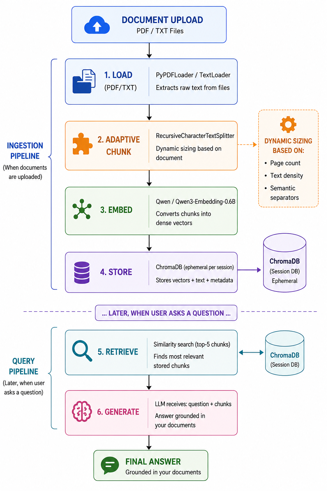

# 05 — RAG (Retrieval-Augmented Generation) Explained

## The Problem RAG Solves

Large Language Models (LLMs) are trained on public internet data up to a cutoff date. They **cannot**:
- Read your private documents
- Access information created after their training cutoff
- Answer questions about your specific files

**RAG bridges this gap** by injecting relevant document content directly into the LLM's prompt at query time.

## RAG Pipeline in SPARK AI



## Adaptive Chunking

SPARK AI dynamically adjusts chunk size based on document characteristics:

| Document Size | Chunk Size | Overlap | Rationale |
|---|---|---|---|
| ≤ 3 pages | 400 chars | 100 | Fine-grained for precise retrieval |
| 4–10 pages | 600 chars | 150 | Balanced precision & context |
| 11–30 pages | 1000 chars | 200 | Moderate chunks |
| 30+ pages | 1500 chars | 300 | Larger chunks to keep count manageable |

**Additional adaptations:**
- **Text density:** Sparse pages (e.g., slides with < 200 chars/page) get smaller chunks
- **Semantic separators:** Splits at `\n\n`, `\n`, `. `, `? `, `! ` boundaries for natural paragraph breaks

### Why top-5 retrieval?
- Top-3 can miss relevant information spread across sections
- Top-5 provides comprehensive coverage without token overload
- Chunks are joined with `---` separators for clear boundaries

### Why ChromaDB?
- **Zero-config:** No database server needed — runs as a local library
- **Fast:** In-memory search with disk persistence
- **Metadata:** Supports filtering by source_file, chunk_index, etc.
- **Ephemeral:** Collections are rotated on session clear — no stale data

### Duplicate Prevention
The system checks if a file with the same name has already been ingested:
```python
existing = self.db.get(where={"source_file": source_name})
if existing and existing.get("ids"):
    return len(existing["ids"])  # Skip — already exists
```
