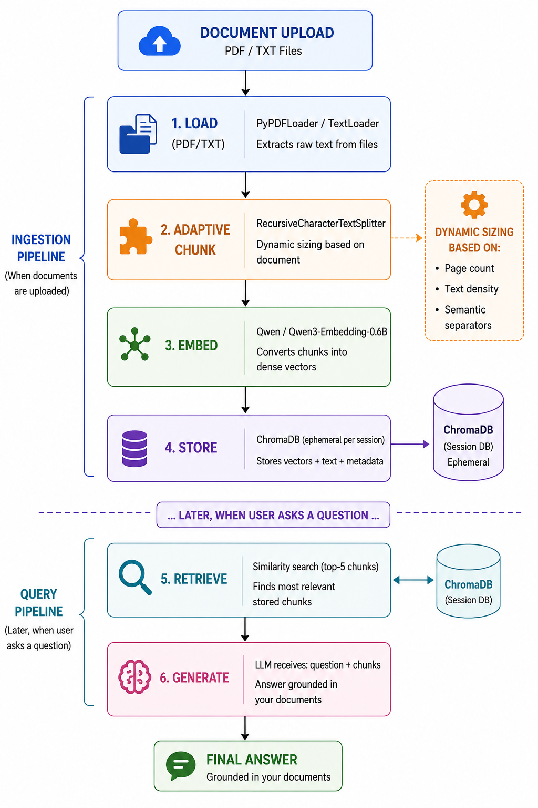

# 05 — RAG (Retrieval-Augmented Generation) Explained

## The Problem RAG Solves

Large Language Models (LLMs) are trained on public internet data up to a cutoff date. They **cannot**:
- Read your private documents
- Access information created after their training cutoff
- Answer questions about your specific files

**RAG bridges this gap** by injecting relevant document content directly into the LLM's prompt at query time.

## RAG Pipeline in SPARK AI



## Adaptive Chunking

SPARK AI dynamically adjusts chunk size based on document characteristics:

| Document Size | Chunk Size | Overlap | Rationale |
|---|---|---|---|
| ≤ 3 pages | 400 chars | 100 | Fine-grained for precise retrieval |
| 4–10 pages | 600 chars | 150 | Balanced precision & context |
| 11–30 pages | 1000 chars | 200 | Moderate chunks |
| 30+ pages | 1500 chars | 300 | Larger chunks to keep count manageable |

**Additional adaptations:**
- **Text density:** Sparse pages (e.g., slides with < 200 chars/page) get smaller chunks
- **Semantic separators:** Splits at `\n\n`, `\n`, `. `, `? `, `! ` boundaries for natural paragraph breaks

### Adaptive Top-K Retrieval & Gemini Embeddings
- **Embeddings:** Powered by Google Gemini (`models/gemini-embedding-001`), converting text chunks into dense, high-dimensional semantic vectors.
- **Top-K Retrieval:** Dynamically configurable from UI controls (defaulting to 10–15 chunks). This ensures comprehensive context extraction across multi-page documents while avoiding context saturation.
- **Source Citation Metadata:** Every retrieved chunk records its `source_file`, `page`, `content_preview`, and `relevance_rank` for interactive UI citations.
- **Prompt Grounding:** Retrieved chunks are injected directly into the active worker prompt template fetched from Langfuse (`worker_general_prompt`, `worker_coding_prompt`, or `worker_creative_prompt`) under the `{context}` variable.

### Why ChromaDB?
- **Zero-config:** No database server needed — runs as a local library
- **Fast:** In-memory search with disk persistence
- **Metadata:** Supports filtering by source_file, chunk_index, etc.
- **Ephemeral:** Collections are rotated on session clear — no stale data

### Duplicate Prevention
The system checks if a file with the same name has already been ingested:
```python
existing = self.db.get(where={"source_file": source_name})
if existing and existing.get("ids"):
    return len(existing["ids"])  # Skip — already exists
```

---

## Corrective RAG (CRAG) & Document Relevance Grading

Standard RAG assumes that if documents are retrieved, they must be relevant. In enterprise environments, passing off-topic chunks to the generator creates **hallucinations or unhelpful responses**.

SPARK AI implements **Corrective RAG (CRAG)** via `grade_documents_node`:
1. **Relevance Grading:** Top retrieved chunks are audited against the user's question by `gemini-3.1-flash-lite` using `document_grader_prompt`.
2. **Binary Decision:** The model classifies the context as `RELEVANT` or `IRRELEVANT`.
3. **Adaptive Web Search Fallback:** If documents are irrelevant, off-topic, or absent, the pipeline automatically diverts to `web_search_node` via SearXNG to fetch live internet ground truth before the worker synthesizes an answer.
4. **Self-Reflective Loop:** If the worker detects that its knowledge is beyond cutoff during draft synthesis, it emits `[NEEDS_WEB_SEARCH: query]`, dynamically triggering live web search and re-generation.
