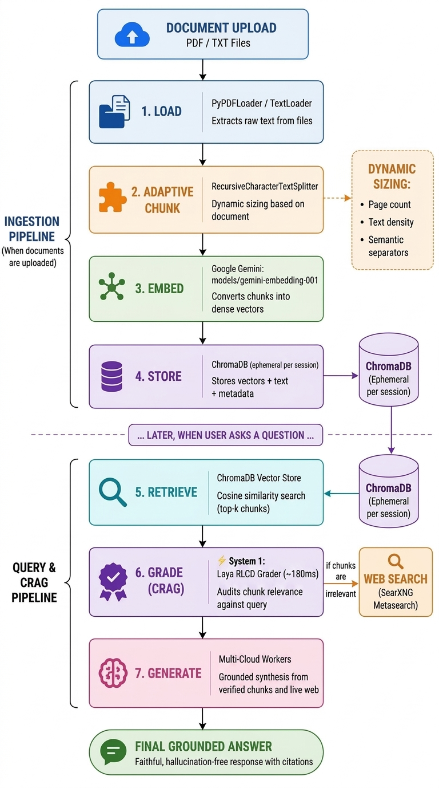
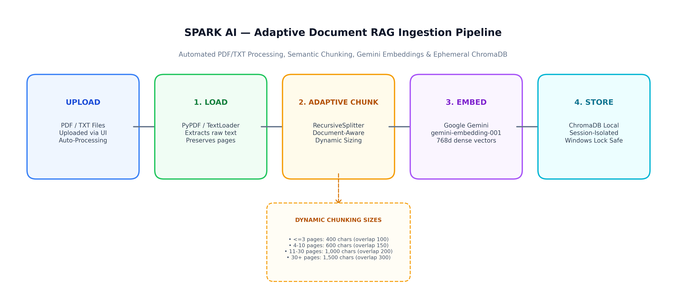

# 05 — Dual-Brain RAG (Retrieval-Augmented Generation) & CRAG

## The Fundamental RAG Challenge

Large Language Models (LLMs) operate under strict parametric boundaries:
1. **Knowledge Cutoff:** They have no inherent awareness of events or documents generated after their training cutoff date.
2. **Private Data Isolation:** They cannot access private corporate documents, proprietary codebases, or local files.
3. **Parametric Hallucination:** When asked about unfamiliar facts, LLMs are prone to generating plausible-sounding but completely fabricated statements.

**Retrieval-Augmented Generation (RAG)** solves this by retrieving relevant text chunks from private documents at runtime and injecting them directly into the LLM's context window.

However, naive RAG often fails in enterprise deployments because:
- **Retrieval Noise:** Irrelevant or borderline chunks pollute the prompt, leading to confused or hallucinated generations.
- **Autoregressive Verification Latency:** Using standard LLMs to grade every document and verify every factual statement introduces 4–8 seconds of latency per turn.

SPARK AI resolves these challenges through **Dual-Brain Corrective RAG (CRAG) and Universal Verification**.

---

## The Dual-Brain RAG Architecture



### 1. Ingestion & Adaptive Chunking
Documents are not uniform. A 2-page invoice has entirely different structural characteristics than a 100-page technical manual. SPARK AI dynamically configures chunk size and overlap based on document length and character density:

| Document Size | Chunk Size | Overlap | Rationale |
|---|---|---|---|
| **≤ 3 pages** (Invoices, receipts) | 400 chars | 100 chars | High-precision chunking for exact data extraction. |
| **4–10 pages** (Articles, reports) | 600 chars | 150 chars | Balanced contextual density and boundary preservation. |
| **11–30 pages** (Whitepapers, guides) | 1,000 chars | 200 chars | Moderate chunking preserving multi-paragraph arguments. |
| **30+ pages** (Books, manuals) | 1,500 chars | 300 chars | Scaled chunks to keep overall vector count manageable. |

- **Density Adaptation:** Low-density documents (e.g. presentation slides with <200 chars/page) automatically receive smaller chunks to prevent empty vectors.
- **Semantic Separators:** Splitting prioritizes logical boundaries (`\n\n` paragraphs, `\n` linebreaks, `. ` sentence boundaries) to preserve coherent thought units.



### 2. High-Throughput Dense Vector Embedding
- **Model:** Google Gemini `models/gemini-embedding-001`.
- **Dimensionality:** 768-dimensional dense semantic vectors.
- **Vector Engine:** ChromaDB (in-memory SQLite persistence).
- **Ephemeral Session Isolation:** When a user clicks "Clear Session" or reloads the tab, a fresh collection UUID is generated, rotating storage immediately without triggering SQLite file-lock conflicts on Windows.
- **Deduplication:** File checksum verification prevents duplicate vector embeddings for already-uploaded files.

---

## ⚡ System 1 Corrective RAG (CRAG)

In standard CRAG, an autoregressive LLM is tasked with reading retrieved chunks and outputting a grading token (`RELEVANT` or `IRRELEVANT`). This approach suffers from two severe flaws:
1. **Latency Overhead:** Generative models require 1.5s–3.0s to initialize, decode, and output a simple binary decision.
2. **Probability Calibration Drift:** Softmax scores from generative models are notoriously uncalibrated and overconfident.

### Laya's Non-Autoregressive Relevance Head
SPARK AI delegates document relevance grading to the **System 1 Laya Decision Engine** running ModernBERT-large fine-tuned with **Reinforcement Learning for Calibrated Decisions (RLCD)**:

1. **Non-Autoregressive Forward Pass:** Laya evaluates the query and retrieved context in a single forward pass (~180ms).
2. **Dual-Signal Output:**
   - `doc_relevance: choice` (`relevant` vs `irrelevant`)
   - `relevance_score: score` (Calibrated continuous score from `0.0` to `2.0`)
3. **Empirical Benchmarks:**
   - **Relevant Documents:** 80.2% probability confidence, calibrated score `1.36 / 2.0`.
   - **Irrelevant / Off-topic Documents:** 98.2% irrelevance confidence, calibrated score `0.018 / 2.0`.

### Dynamic Web Search Fallback (SearXNG)
If System 1 grades the retrieved chunks as `irrelevant` (or relevance score < 1.0):
1. The pipeline automatically marks `doc_relevance = "IRRELEVANT"`.
2. The LangGraph router diverts execution to `web_search_node`.
3. SearXNG executes a live internet search, extracting up-to-date web snippets and URLs.
4. The synthesized web context replaces the irrelevant document chunks, ensuring the worker receives truthful grounding before generating an answer.

---

## 🔬 System 1 Universal Verification (Self-RAG)

Before a generated draft is returned to the user, it must be verified to prevent subtle factual hallucinations.

### Non-Autoregressive Faithfulness Check
SPARK AI utilizes Laya's **Universal Verification** primitive (`backend/laya_client.py`):
```python
is_faithful, confidence, telemetry = laya_client.verify_claim_faithfulness(
    query=user_request,
    context=retrieved_context,
    draft=draft_response
)
```

- **Mechanism:** Evaluates whether each factual claim asserted in the draft is mathematically entailment-supported by the retrieved document context.
- **Empirical Accuracy:**
  - True / Faithful Claims: **98.3%** entailment probability.
  - Fabricated / Contradicted Claims: **93.4%** hallucination detection probability.
- **Execution Speed:** ~200ms non-autoregressive verification (vs 3.5s for an LLM audit).

### Two-Stage Verification Pipeline


1. **Stage 1 (System 1 Reflex):** If Laya detects a hallucination with ≥85% confidence, the pipeline flags the draft immediately and routes to live SearXNG search to retrieve factual grounding.
2. **Stage 2 (System 2 Deep Reasoning):** If the draft passes System 1 verification, Gemini 3.1 Flash-Lite conducts a deep multi-dimensional check (relevance, factuality, temporal cutoff detection) using `validator_prompt`.
3. **Langfuse Trace Scoring:** The final validation outcome automatically publishes a numeric score (`quality_validation` = `1.0` or `0.0`) to the active Langfuse trace.
