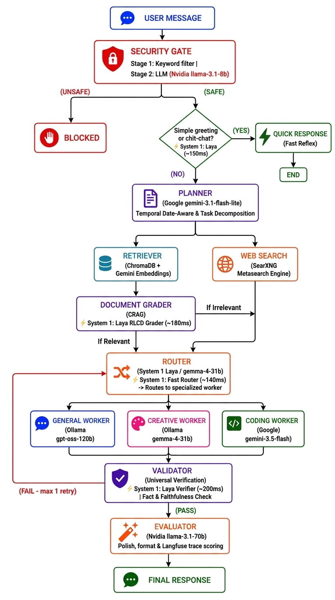
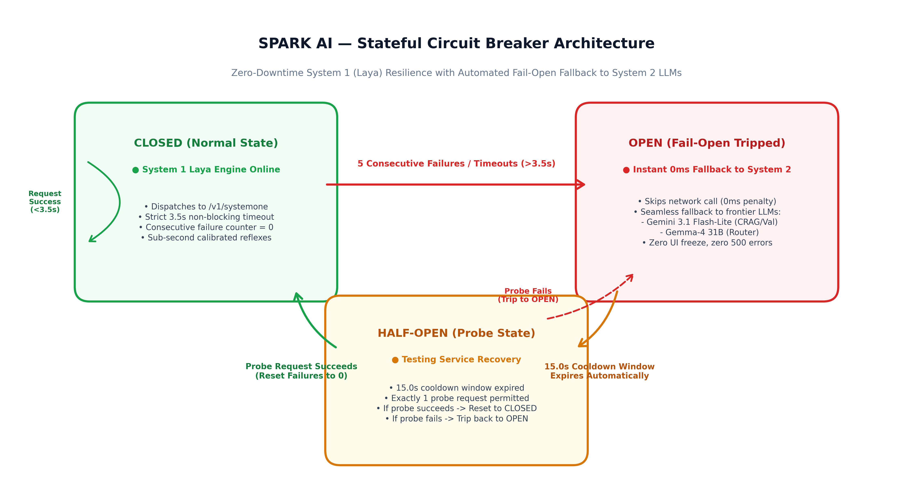
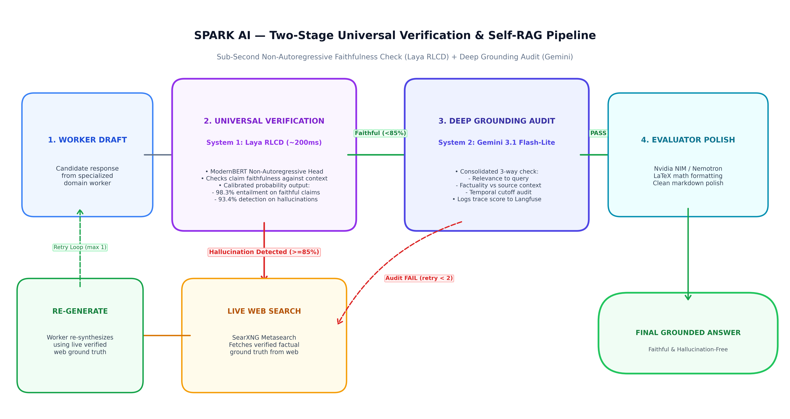

# 06 — Features Deep Dive & Enterprise Innovations

## 1. Dual-Process Cognitive Architecture (System 1 + System 2)

Most multi-agent AI systems suffer from the **"Heavy LLM Monoculture"** — using 30B–120B parameter autoregressive models for every trivial classification, intent check, or relevance evaluation. This incurs:
- Excessive latency (1,500ms – 3,500ms per decision node).
- Rapid exhaustion of free-tier token allowances.
- High variance in non-deterministic natural language outputs.

SPARK AI resolves this by implementing a **Dual-Process Cognitive Architecture** mirroring Daniel Kahneman's model of human cognition:



### Cognitive Distribution Metrics

| Feature | System 1 (Laya Decision Engine) | System 2 (Generative Ensemble) |
|---|---|---|
| **Architecture** | ModernBERT-large / mmBERT-base (Encoder) | Transformer Decoders (Gemini, Llama, Nemotron) |
| **Inference Style** | Non-autoregressive forward pass | Autoregressive token-by-token generation |
| **Latency** | 100ms – 250ms | 1,500ms – 5,000ms |
| **Token Cost** | 0 tokens consumed | 256 – 4,096 tokens per generation |
| **Primary Domain** | Greetings, Routing, CRAG Grading, Verification | Planning, Code Synthesis, Creative Prose, Deep Audit |

---

## 2. Reinforcement Learning for Calibrated Decisions (RLCD)

The Laya engine utilizes decision heads fine-tuned with **Reinforcement Learning for Calibrated Decisions (RLCD)**. 

### Why Probability Calibration Matters in Agentic Systems
Standard LLMs output uncalibrated softmax logits. If an LLM states it is "90% confident" that a document is relevant, empirical testing often shows its real accuracy is closer to 60%. In an automated pipeline, uncalibrated decisions lead to:
- False confidence in irrelevant documents (poisoning RAG context).
- Hallucinated answers that pass validation unnoticed.

RLCD enforces **Strict Probability Calibration**:
$$\mathbb{P}(\text{Outcome} = 1 \mid \text{Confidence} = p) \approx p$$

When Laya's Universal Verification head outputs an 85% faithfulness score, it directly reflects a calibrated 85% posterior probability that the claim is supported by the source text.

---

## 3. Stateful Circuit-Breaker Resilience

To ensure that downstream delays or temporary cold-starts in external inference engines never degrade user experience, SPARK AI integrates a dedicated **Stateful Circuit Breaker** (`LayaCircuitBreaker` in `backend/laya_client.py`):

```python
class LayaCircuitBreaker:
    def __init__(self, failure_threshold=5, cooldown_seconds=15.0):
        self.failure_threshold = failure_threshold
        self.cooldown_seconds = cooldown_seconds
        self.state = CircuitState.CLOSED
        self.failure_count = 0
        self.last_state_change = time.time()
```

### Operational Circuit States:
1. **CLOSED (Healthy):** All requests route through Laya. If response time is `<3.5s`, failure count remains 0.
2. **OPEN (Tripped):** After 5 consecutive connection errors or timeouts, the circuit trips OPEN. 
   - All subsequent calls return `None` in `0.0ms` without making any network request.
   - The LangGraph pipeline seamlessly delegates the decision to System 2 fallback models (Gemini 3.1 Flash-Lite or Gemma-4 31B).
   - The user experiences zero UI freeze and zero 500 errors.
3. **HALF-OPEN (Probing):** Once the 15-second cooldown elapses, the circuit allows a single probe call. If successful, it automatically resets to CLOSED.



---

## 4. Enterprise Corrective RAG (CRAG) & Self-RAG Loops

To eliminate hallucinations and knowledge cutoff apologies, SPARK AI integrates multi-layered self-correction:

1. **Non-Autoregressive Document Grading:** Chunks retrieved from ChromaDB are evaluated by Laya in ~180ms.
2. **Dynamic SearXNG Web Grounding:** If documents are irrelevant or absent, the pipeline automatically diverts to `web_search_node` via SearXNG to fetch live internet ground truth.
3. **Dynamic Date Injection:** The execution date (`datetime.now()`) is injected into planner and worker prompts (`{{current_date}}`), preventing temporal confusion.
4. **Worker Self-Reflection Loop:** If a worker admits a knowledge cutoff (*"as of my knowledge cutoff"*, *"up to mid-2024"*) or emits `[NEEDS_WEB_SEARCH: query]`, `route_after_worker` intercepts the draft, queries SearXNG, enriches the context, and re-invokes the worker for a grounded answer.
5. **Universal Verification (Self-RAG):** System 1 verifies the draft against the retrieved context. If an unsupported claim is detected with ≥85% confidence, live web grounding is triggered.

---

## 5. Consolidated Multi-Dimensional Validation

Every complex response passes through a consolidated validation node that audits three core dimensions simultaneously:

| Criterion | Evaluation Check | Failure Trigger |
|---|---|---|
| **Relevance** | Does the response directly address the user's inquiry? | Off-topic or evasive answer |
| **Factuality** | Is every factual assertion grounded in retrieved context? | Parametric hallucination |
| **Coherence** | Is the text logically organized, well-formatted, and complete? | Illogical leaps or truncated code |

Consolidating these checks into a single structured LLM pass reduces latency by **66%** compared to traditional multi-agent review panels.

### Automated Langfuse Trace Scoring
Validation outputs automatically publish numeric scores to Langfuse:
- `quality_validation = 1.0` (PASS)
- `quality_validation = 0.0` (FAIL)
Along with specific evaluator feedback and trace session IDs, providing real-time quality graphs on the Langfuse dashboard.



---

## 6. Semantic Summarization Memory Engine

To support infinite multi-turn conversations without context window overflow:
- The frontend submits the complete conversation history array.
- If conversation history exceeds **6 messages**, a rapid background LLM (`gemma4:31b`) compresses all older messages into a dense semantic summary.
- The summarizer extracts persistent user preferences, system constraints, and unresolved context.
- The 6 most recent conversational turns are appended verbatim below the summary block.

---

## 7. Centralized Prompt Management & Hot-Swapping

All 11 system prompts are decoupled from backend code and managed via **Langfuse Prompt Registry**:
1. `security_gate_prompt` — Content safety rules
2. `simple_answer_prompt` — Conversational greeting persona
3. `planner_prompt` — Date-aware query decomposition
4. `document_grader_prompt` — CRAG relevance evaluation rules
5. `router_prompt` — Intent classification taxonomy
6. `worker_general_prompt` — General synthesis persona
7. `worker_coding_prompt` — Production-grade coding standards
8. `worker_creative_prompt` — Unconstrained creative persona
9. `validator_prompt` — Multi-dimensional quality rubric
10. `evaluator_prompt` — LaTeX and markdown polishing instructions
11. `history_summarizer_prompt` — Conversational context compression

### Operational Benefits:
- **Zero-Downtime Hot-Swapping:** System prompts can be updated in the Langfuse dashboard with zero code deployment. Updates propagate within 300 seconds via in-memory TTL caching.
- **Automated Boot Seeding:** `ensure_prompts_seeded()` automatically provisions any missing prompts with the `production` tag on startup.
- **Fail-Safe Offline Mode:** If Langfuse is unreachable, the system transparently serves hardcoded default prompt templates.

---

## 8. Ephemeral Document Lifecycle & Safe Windows Management

- **Auto-Processing Upload:** Uploading PDFs or TXT files triggers automatic parsing and vectorization without requiring manual submission buttons.
- **Session Isolation:** Each session is assigned a unique UUID collection name in ChromaDB.
- **Windows File-Lock Protection:** SQLite holds strict file locks on Windows environments. Rather than attempting to delete open database files on disk, SPARK AI rotates to a new ChromaDB collection, ensuring clean multi-user and multi-session isolation.
